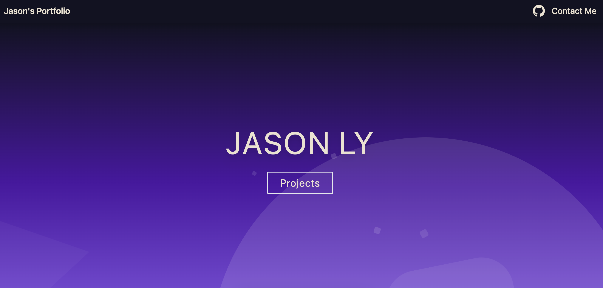

<h1 align="center">Portfolio Website ️📃</h1>

<h4 align="center">A portfolio website showcasing my projects. <a href="" alt="Website link">Open portfolio</a></h4>

    <a href="#preview" style="text-decoration: none"><b>Preview</b></a> •
    <a href="#technologies" style="text-decoration: none"><b>Technologies</b></a>

<h2 id="preview">🎴 Preview</h2>

<h2 id="technologies">⚙️ Technologies</h2>
<ul>
<li><a href="https://astro.build/" style="text-decoration: none"><b>Astro</b></a> - Frontend framework</li>
<li><a href="https://tailwindcss.com/" style="text-decoration: none"><b>TailwindCSS</b></a> - CSS framework</li>
<li><a href="https://react.dev/" style="text-decoration: none"><b>React</b></a> - User interface library</li>
</ul>
